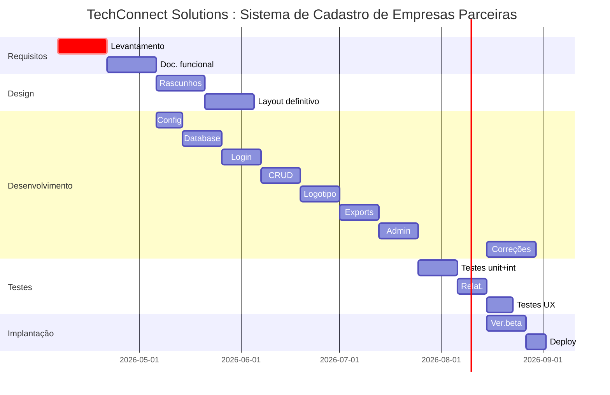
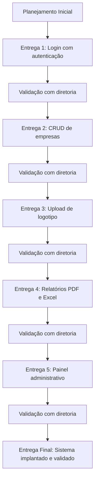

```mermaid
gantt
    title TechConnect Solutions : Sistema de Cadastro de Empresas Parceiras
    dateFormat YYYY-MM-DD
    
    section Requisitos
    Levantamento               :crit, req, 2026-04-06, 15d
    Doc. funcional             :doc, after req, 15d
    section Design
    Rascunhos                  :ras, after doc, 15d
    Layout definitivo          :lay, after ras, 15d
    section Desenvolvimento
    Config                     :con, after doc, 8d
    Database                   :bd, after con, 12d
    Login                      :log, after bd, 12d
    CRUD                       :crud, after log, 12d
    Logotipo                   :lgt, after crud, 12d
    Exports                    :exp, after lgt, 12d
    Admin                      :adm, after exp, 12d
    Correções                  :cor, after rel, 15d
    section Testes
    Testes unit+int             :tst, after adm, 12d
    Relat.                      :rel, after tst, 9d
    Testes UX                   :usb, after rel, 8d
    
    
    section Implantação
    Ver.beta                    :beta, after rel, 12d
    Deploy                      :deploy, after beta, 6d
```

```mermaid
flowchart TD
    A[Planejamento Inicial] --> B[Entrega 1: Login com autenticação]
    B --> C[Validação com diretoria]
    C --> D[Entrega 2: CRUD de empresas]
    D --> E[Validação com diretoria]
    E --> F[Entrega 3: Upload de logotipo]
    F --> G[Validação com diretoria]
    G --> H[Entrega 4: Relatórios PDF e Excel]
    H --> I[Validação com diretoria]
    I --> J[Entrega 5: Painel administrativo]
    J --> K[Validação com diretoria]
    K --> L[Entrega Final: Sistema implantado e validado]
```
