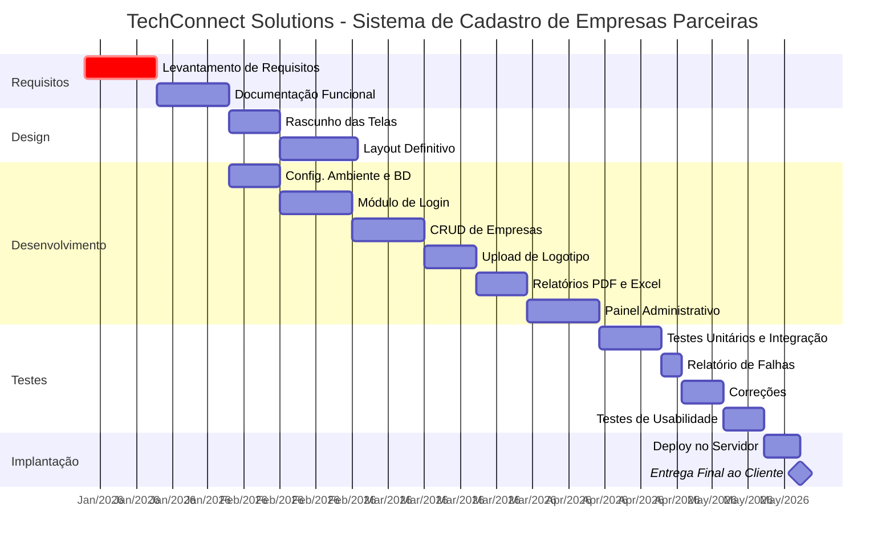
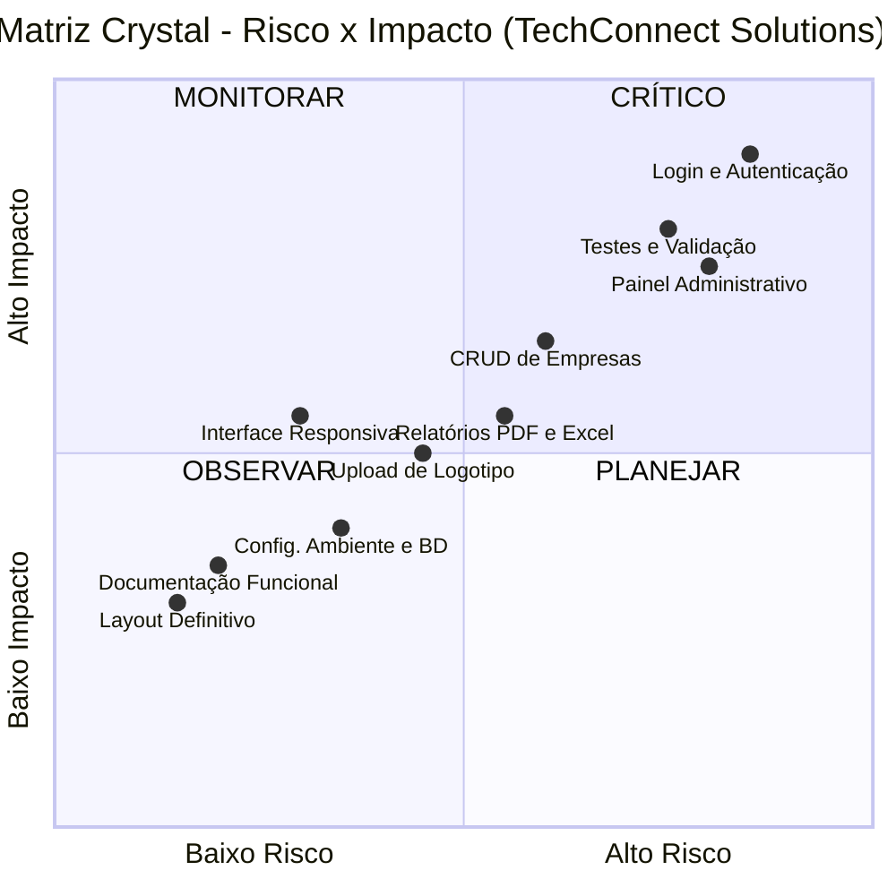

```mermaid
gantt
    title TechConnect Solutions - Sistema de Cadastro de Empresas Parceiras
    dateFormat YYYY-MM-DD
    axisFormat %b/%Y

    section Requisitos
    Levantamento de Requisitos     :crit, req, 2026-01-01, 14d
    Documentação Funcional         :doc, after req, 14d

    section Design
    Rascunho das Telas             :mod, after doc, 10d
    Layout Definitivo              :lay, after mod, 15d

    section Desenvolvimento
    Config. Ambiente e BD          :cfg, after doc, 10d
    Módulo de Login                :lgn, after cfg, 14d
    CRUD de Empresas               :crd, after lgn, 14d
    Upload de Logotipo             :lgt, after crd, 10d
    Relatórios PDF e Excel         :exp, after lgt, 10d
    Painel Administrativo          :adm, after exp, 14d

    section Testes
    Testes Unitários e Integração  :tst, after adm, 12d
    Relatório de Falhas            :rel, after tst, 4d
    Correções                      :cor, after rel, 8d
    Testes de Usabilidade          :usb, after cor, 8d

    section Implantação
    Deploy no Servidor             :deploy, after usb, 7d
    Entrega Final ao Cliente       :milestone, after deploy, 0d
```

```mermaid
quadrantChart
    title Matriz Crystal - Risco x Impacto (TechConnect Solutions)
    x-axis Baixo Risco --> Alto Risco
    y-axis Baixo Impacto --> Alto Impacto

    quadrant-1 CRÍTICO
    quadrant-2 MONITORAR
    quadrant-3 OBSERVAR
    quadrant-4 PLANEJAR

    Login e Autenticação: [0.85, 0.90]
    Painel Administrativo: [0.80, 0.75]
    Testes e Validação: [0.75, 0.80]
    CRUD de Empresas: [0.60, 0.65]
    Relatórios PDF e Excel: [0.55, 0.55]
    Upload de Logotipo: [0.45, 0.50]
    Interface Responsiva: [0.30, 0.55]
    Config. Ambiente e BD: [0.35, 0.40]
    Documentação Funcional: [0.20, 0.35]
    Layout Definitivo: [0.15, 0.30]
```
