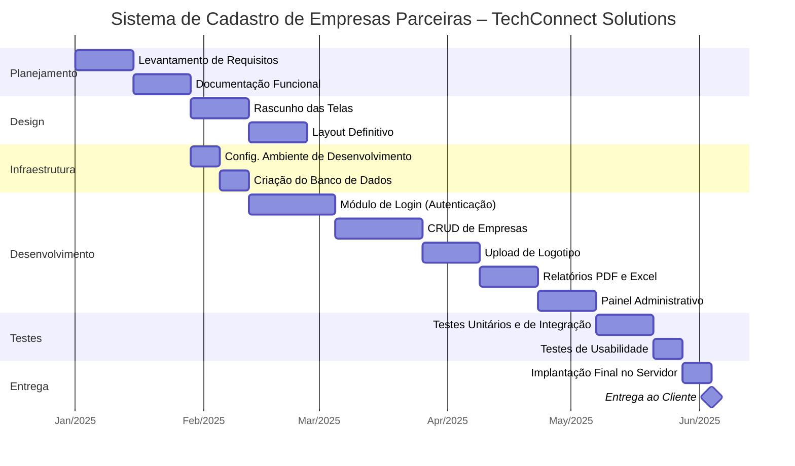
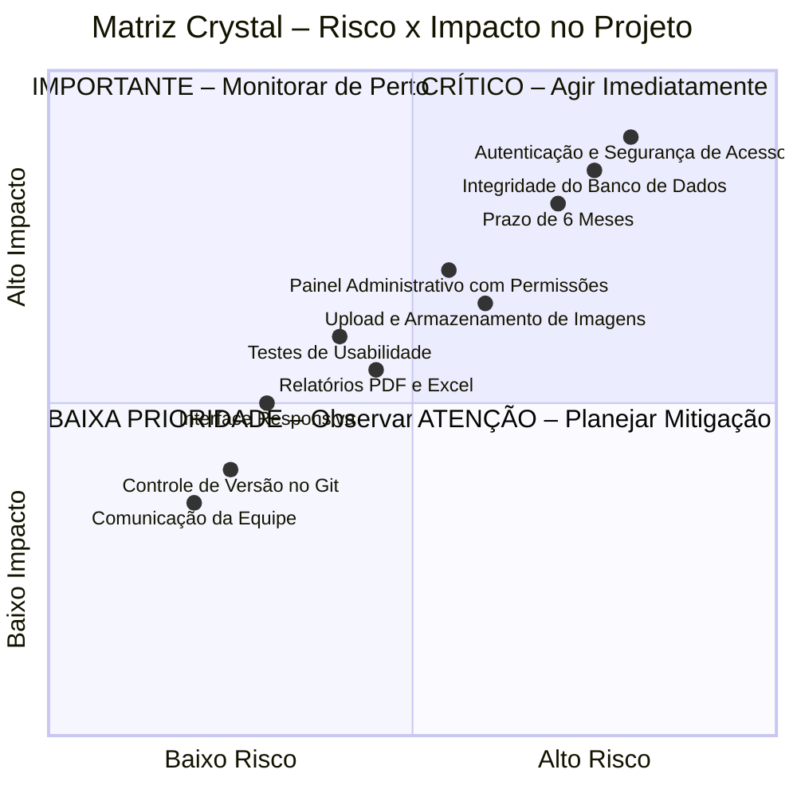

# Gestão Ágil de Projetos – TechConnect Solutions
**Sistema de Cadastro de Empresas Parceiras**

---

## Gráfico de Gantt – Cronograma do Projeto (6 meses)

---

## Matriz Crystal – Situações que Requerem Atenção

---

## Entregas Incrementais (Crystal Clear)

| # | Entrega | Funcionalidade | Responsável |
|---|---------|---------------|-------------|
| 1 | Entrega 1 | Módulo de Login com Autenticação | Desenvolvedor + QA |
| 2 | Entrega 2 | CRUD de Empresas Ativo | Desenvolvedores |
| 3 | Entrega 3 | Upload de Logotipo integrado ao Cadastro | Desenvolvedor |
| 4 | Entrega 4 | Relatórios em PDF e Excel | Desenvolvedor |
| 5 | Entrega 5 | Painel Administrativo com Permissões | Desenvolvedor + QA |
| 6 | Entrega Final | Sistema Testado, Implantado e Validado | Toda a Equipe |

> A cada entrega parcial, a diretoria será convidada para revisar as funcionalidades, sugerir melhorias e validar os requisitos.
